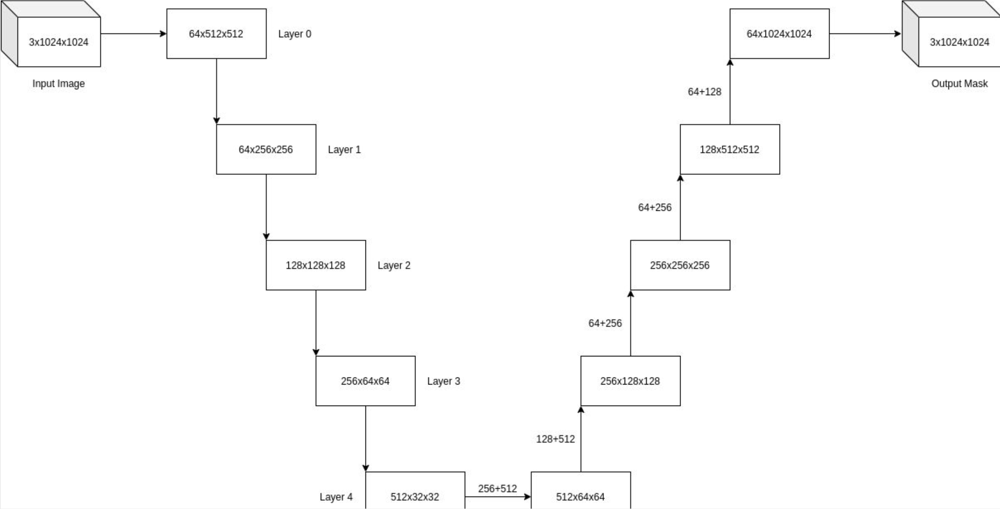
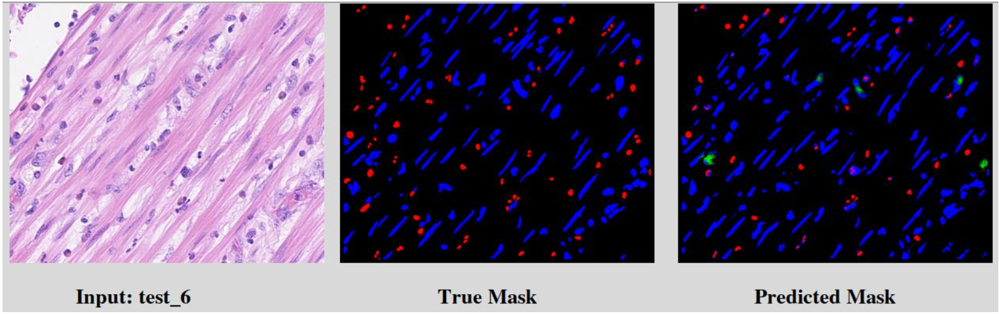
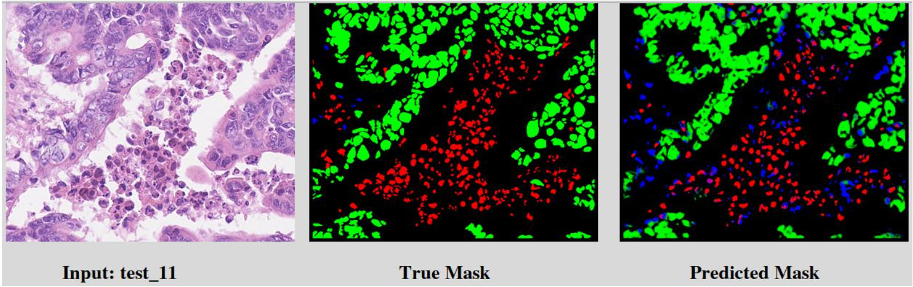

# Nuclei Segmentation

This project is about Nuclei Segmentation. This submission consists of the following files and folders:

- Test folder containing test images and labels
- Train folder containing train images and labels
- model.py contains the code for the UNet used in this project
- utils.py contains code for the custom Dataset class that will preprocess the data
- train.py contains the code that trains a model and evaluates it
- evaluate.py contains the code for evaluating a saved model.
- predict.py contains the code for predicting and displaying the mask for a single image. 
- gui.py contains the code which will launch the gui for you to use


## Model Shape Transformation



First and foremost, you can download our pre-saved weights here: https://drive.google.com/file/d/1MCTlxPi1al8dj8XBM_AQtSmw9_CJOclY/view?usp=sharing

The path of this saved weights is required if you want to run "evaluate.py" or "gui.py"


## Train

To train the model, one needs to run the train.py file. But first, you must edit the following information

- Path to training images and labels 

- Path to testing images and labels 

Then, simply run the following command to train the model:

```bash
python3 train.py
```

The evaluation results are individual dice and jaccard scores for each class of nuclei, as well as the mean scores for both.


## Evaluate

To evaluate the model, one needs to run the evaluate.py file. But first, you must edit the following information

- Path to testing images and labels 
- Path to saved weights

Then, simply run the following command to evaluate the model:

```
python3 evaluate.py
```


## GUI

To use the GUI properly, you must first edit:

- Path to saved weights

Then, simply run the following command to launch the GUI:

```
python3 gui.py
```

After it is launched, please click select an image and upload an image from the test folder. Once the image is loaded, click predict to view the True mask as well as the predicted mask.


### Example Output

1)



2)

